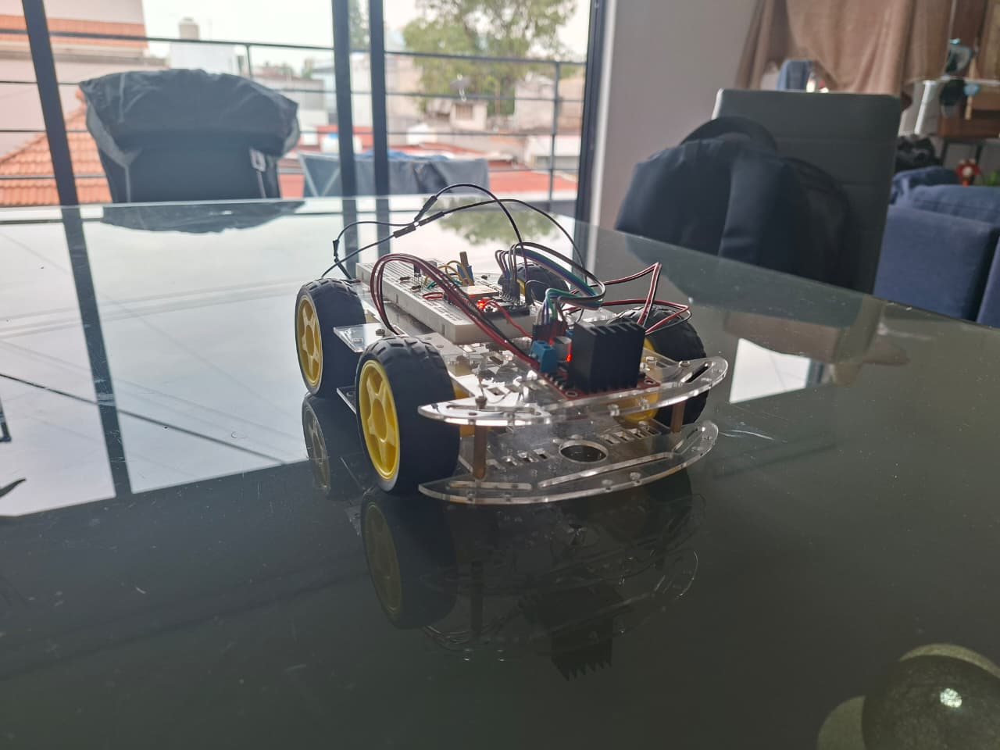
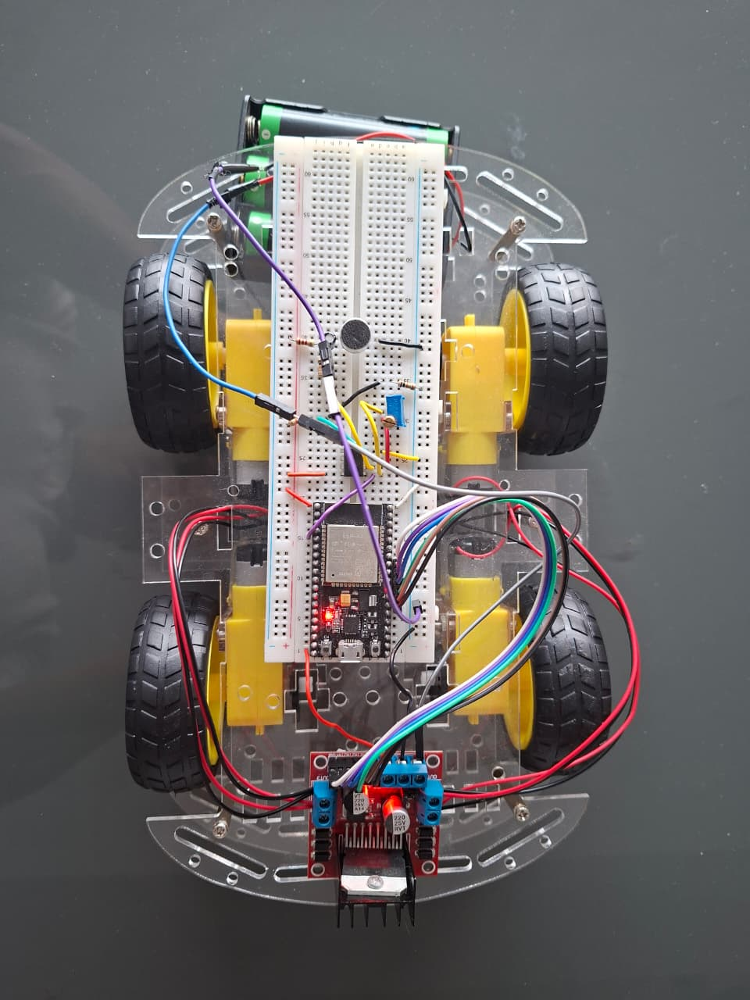
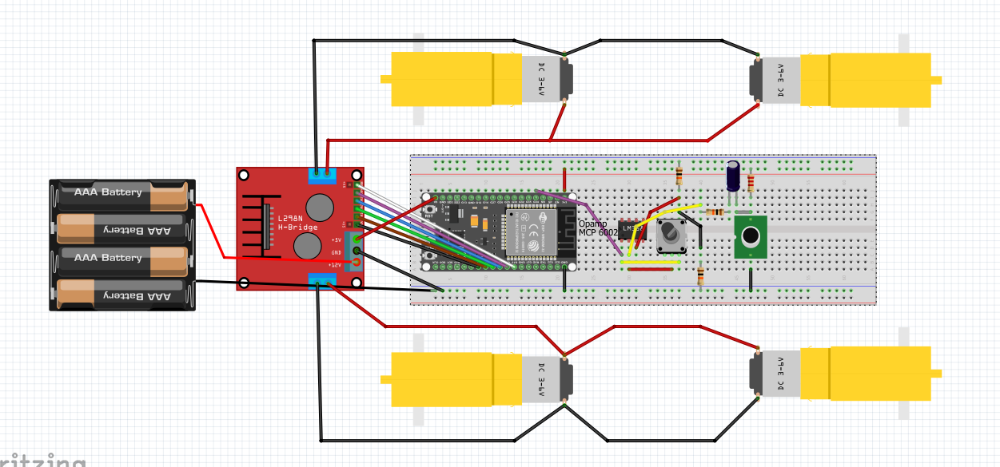

# Voice-Controlled Car

ESP32-based mobile robot controlled by offline voice commands using analog signal conditioning, band-pass filtering, energy-based classification, and dual-channel motor control.

<p align="center">
  
</p>

## Overview

This project implements a four-wheel mobile robot that responds to voice commands without requiring Wi-Fi, Bluetooth, cloud services, or external speech-recognition platforms.

An electret microphone captures the user's voice, while an MCP6002 operational amplifier conditions the analog signal before it is sampled by the ESP32 ADC.

The ESP32 processes the signal in real time using a 300–1500 Hz digital band-pass filter and calculates the mean signal energy over a 300 ms analysis window. Experimentally calibrated energy thresholds are then used to distinguish between the voice commands **"I"** and **"O"**.

The detected command is translated into motor movement through an L298N dual H-bridge controlling four TT DC motors.

## System Architecture

```text
Voice
  │
  ▼
Electret Microphone
  │
  ▼
MCP6002 Signal Conditioning
  │
  ▼
ESP32 ADC
  │
  ▼
Digital Band-Pass Filter
300 Hz – 1500 Hz
  │
  ▼
Mean Energy Extraction
  │
  ▼
Voice Command Classification
  │
  ├── O → Forward
  ├── I → Reverse
  └── No valid command → Stop
  │
  ▼
L298N Motor Driver
  │
  ▼
4 × TT DC Motors
```

## Key Features

- Offline voice-command detection
- ESP32-WROOM as the main processing unit
- 12-bit ADC acquisition through GPIO34
- MCP6002 analog signal conditioning
- 4 kHz audio sampling frequency
- 300–1500 Hz digital band-pass filtering
- Energy-based voice-command classification
- Experimentally calibrated detection thresholds
- PWM motor-speed control
- Four-motor drive with two independently driven H-bridge channels, each controlling two TT motors
- No cloud processing or external communication required

## Hardware

The prototype is built around an ESP32-WROOM development board and an L298N dual H-bridge.

Two TT motors are connected to each motor-driver channel, allowing both sides of the vehicle to be controlled independently.

<p align="center">
  
</p>

### Main Components

| Component | Function |
|---|---|
| ESP32-WROOM | Signal acquisition, processing, classification and motor control |
| Electret microphone | Voice acquisition |
| MCP6002 | Analog signal conditioning |
| L298N | Dual H-bridge motor driver |
| 4 × TT DC motors | Vehicle traction |
| Breadboard | Prototype circuit integration |

## ESP32 Pin Assignment

| Signal | ESP32 GPIO |
|---|---:|
| Microphone ADC | GPIO34 |
| ENA | GPIO4 |
| IN1 | GPIO16 |
| IN2 | GPIO17 |
| IN3 | GPIO5 |
| IN4 | GPIO18 |
| ENB | GPIO19 |

## Signal Processing

The conditioned microphone signal is sampled by the ESP32 at:

$$
f_s = 4000\ \text{Hz}
$$

which corresponds to a sampling period of:

$$
T_s = 1/f_s = 250\ \mu s
$$

A first-order digital high-pass filter with a cutoff frequency of **300 Hz** is followed by a first-order low-pass filter with a cutoff frequency of **1500 Hz**, producing an effective band-pass response.

The energy of the filtered signal is calculated as:

$$
E = \frac{1}{N}\sum_{n=0}^{N-1} y[n]^2
$$

Using a 300 ms analysis window:

$$
N \approx 4000(0.3) = 1200
$$

samples are evaluated for each classification decision.

## Voice Command Classification

The classification thresholds were determined experimentally using the physical prototype.

| Energy Range | Command | Vehicle Action |
|---|---|---|
| `0.00015 < E < 0.00150` | I | Reverse |
| `0.00150 <= E <= 0.00192` | — | Dead zone / No command |
| `E > 0.00192` | O | Forward |
| Outside valid ranges | None | Stop |

> The energy thresholds are empirical values and depend on microphone sensitivity, analog gain, speaker characteristics, distance, and environmental noise.

## Motor Control

The L298N controls the four TT motors as two independent drive channels:

```text
Channel A
├── Left front motor
└── Left rear motor

Channel B
├── Right front motor
└── Right rear motor
```

### PWM Configuration

| Parameter | Value |
|---|---:|
| PWM frequency | 1 kHz |
| PWM resolution | 8 bits |
| Motor command | 150 / 255 |
| Approximate duty cycle | 58.8% |
| Command lockout | 1500 ms |

## Wiring Diagram

<p align="center">
  
</p>

The diagram shows the physical wiring used for the prototype, including the ESP32, MCP6002 signal-conditioning stage, L298N motor driver, microphone and four TT motors.

## Getting Started

1. Assemble the circuit according to the wiring diagram.
2. Open `firmware/voice_controlled_car/voice_controlled_car.ino` in Arduino IDE.
3. Select the corresponding ESP32 board and compile using Arduino-ESP32 Core 3.x.
4. Upload the firmware to the ESP32.
5. Open the Serial Monitor at **115200 baud**.
6. Use the calibrated voice commands:
   - **O** → Forward
   - **I** → Reverse

> The detection thresholds were calibrated experimentally for this prototype and may require adjustment when changing the microphone, analog gain, speaker, or operating environment.

## Demonstration

A functional test of the physical prototype is available here:

[View voice-control demonstration](media/demos/voice-control-demo.mp4)

The demonstration shows the vehicle responding to the calibrated voice commands and driving the four-motor platform through the L298N.

## Firmware

The Arduino firmware is located at:

```text
firmware/voice_controlled_car/voice_controlled_car.ino
```

### Software Environment

- Arduino IDE
- Arduino-ESP32 Core 3.x
- ESP32-WROOM
- Serial monitor: 115200 baud

## Repository Structure

```text
voice-controlled-car/
│
├── README.md
│
├── firmware/
│   └── voice_controlled_car/
│       └── voice_controlled_car.ino
│
├── docs/
│   └── hardware/
│       └── wiring-diagram.png
│
└── media/
    ├── images/
    │   ├── robot-front-view.jpeg
    │   ├── robot-overview.jpeg
    │   └── hardware-top-view.jpeg
    │
    └── demos/
        └── voice-control-demo.mp4
```

## Project Status

**Functional prototype validated on physical hardware.**

The current implementation successfully performs:

- Microphone signal acquisition
- Analog signal conditioning
- Real-time digital filtering
- Energy-based command detection
- Forward and reverse voice control
- Four-motor PWM actuation